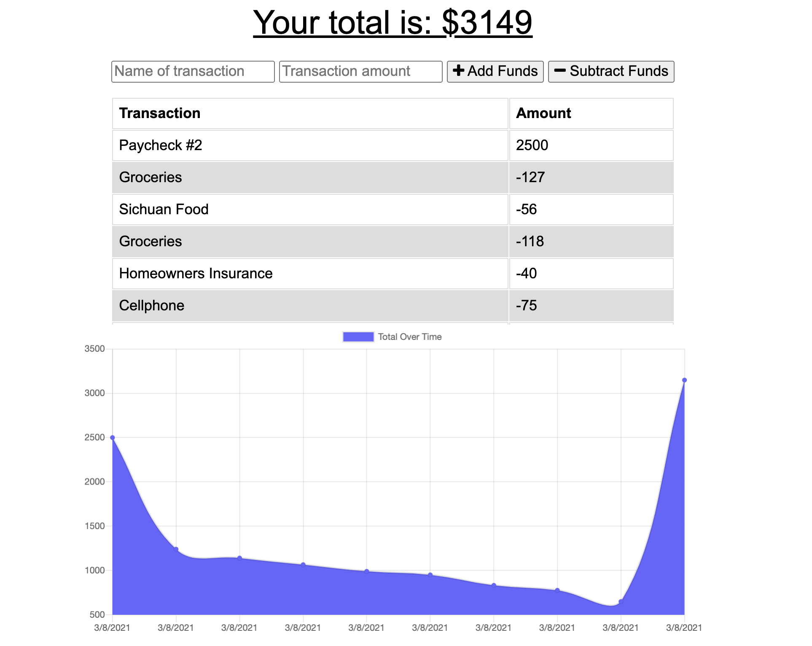

  # MiNOS

   

  ## Overview
  MiNOS is a budget tracking application that allows for offline access and functionality. Users are able to add expenses and deposits to their budget with or without a connection. When entering transactions offline, they are accesible to users and then stored on the cloud when back online. Giving users a fast and easy way to track their money is important, but allowing them to access that information anytime is even more important. Having offline functionality is paramount to your financial success.

  

  ### Watch the preview video [here](https://www.loom.com/embed/c820b1ce02284710aeb4c5a7413d8f79) ... or try the app [here!](https://minos-budget.herokuapp.com/)
  

   

  ## Table of Contents
  1. [Usage](#Usage)
  2. [Contributing](#Contributing)
  3. [License](#License)
  4. [Questions](#Questions)
  

   

  ## Usage
  To get started, consider the following: 
  Users are able to add expenses and deposits to their budget with or without a connection. When entering transactions offline, they are accesible to users and then stored on the cloud when back online.
  

   

  ## Contributing

  ### Accepted Contributions:
  The following contributions are allowed for this project: 
  <ul>
    <li>creating issues</li><li>pull requests</li><li>suggesting enhancements</li><li>reporting bugs</li><li>documentation</li>
  </ul>
   

  ### Guidelines
  To contribute to this project, please abide by the following: 
  Communication: please contact the code owner if you are interested in contributing.
  

   

  ## License
  This project is licensed under the Apache 2.0 license.
  For more information refer to this link: 
  

   

  ## Questions
  To communicate with the project owner, use the following contact information: 
  Created by: stephenlprice  
  You can ask me any questions at this address: stellopricint@gmail.com
  